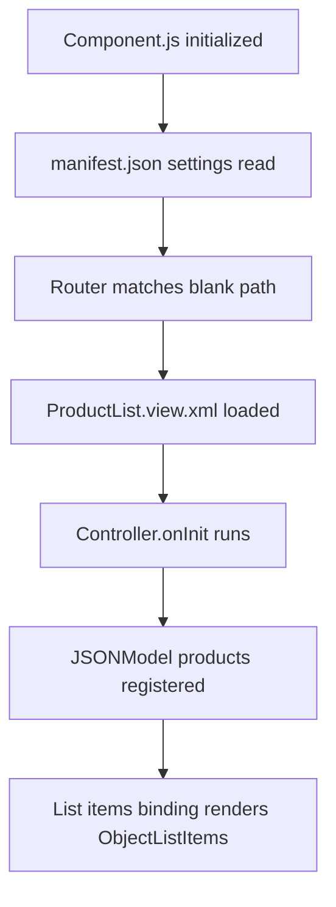

*Figure 1: Developing your first Fiori application using the SAPUI5 framework.*

Okay so here is the thing.

Every SAPUI5 tutorial I found when I was starting out did one of two things. Either it went straight into complex code without explaining what anything meant. Or it spent so long on theory that by the time actual coding started, I had already lost interest.

So this post is my attempt to do it differently.

We are going to build a real SAPUI5 application together — **step by step** — and I am going to explain every single line in plain English. Not just "this is a controller" and moving on. Actually explaining what it does, why it exists, and what happens if you remove it.

By the end of this post, you will have a working SAPUI5 app running in your browser. A product list application that displays data, looks like a real Fiori app, and gives you a solid foundation to build on.

Let's start from absolute zero.

---

## What Are We Building?

Before writing any code, let's be clear about what we are building.

We are creating a simple **Product List App** — a Fiori-style application that shows a list of products with their names, IDs, and prices. It will have a proper Fiori page header, a search bar, and a clean list of items.

Nothing over-complicated. But not just a "Hello World" either. Something that actually looks like a real SAP Fiori app and teaches you the concepts that every bigger SAPUI5 project uses.

---

## What You Need Before Starting

Good news — you need almost nothing installed.

### Option 1 — SAP Business Application Studio (Recommended)
This is a browser-based IDE that SAP provides. No installation at all. You write code in your browser and preview the app in the same browser.

Go to [account.hanatrial.ondemand.com](https://account.hanatrial.ondemand.com) → Create a free SAP BTP trial account → Open Business Application Studio → Create a Dev Space with the **SAP Fiori** template.

### Option 2 — VS Code with UI5 Tooling
If you prefer local development:
1. Install [VS Code](https://code.visualstudio.com/).
2. Install [Node.js](https://nodejs.org/).
3. Install UI5 CLI globally by running:
   ```bash
   npm install -g @ui5/cli
   ```
4. Install the **SAP Fiori Tools - Extension Pack** from the VS Code Marketplace.

Either option works perfectly for this tutorial. I'll write instructions that apply to both.

---

## Understanding the Project Structure First

Before creating files, understand what a SAPUI5 project looks like. This mental map saves enormous confusion later.


*Figure 2: Layout map of a standard SAPUI5 MVC web application.*

Here is the folder structure we will build:

```text
MyProductApp/
│
├── webapp/                    ← All your app code lives here
│   ├── controller/
│   │   └── ProductList.controller.js   ← App logic
│   ├── view/
│   │   └── ProductList.view.xml        ← What user sees
│   ├── model/
│   │   └── models.js                   ← Data setup
│   ├── i18n/
│   │   └── i18n.properties             ← Text translations
│   ├── Component.js                    ← App entry point
│   └── manifest.json                   ← App configuration
│
├── ui5.yaml                   ← UI5 tooling configuration
└── package.json               ← Node dependencies
```

Let me explain each piece in simple words:
* **`webapp` folder** — everything your app needs lives inside here. Think of it as your app's home.
* **`controller` folder** — contains JavaScript files that handle logic (e.g., button clicks, searching, navigation).
* **`view` folder** — contains XML files describing what the user sees (buttons, lists, fields).
* **`model` folder** — contains code setting up local/remote data models.
* **`i18n` folder** — contains translation files for localized text.
* **`Component.js`** — the startup class file. The SAP Fiori Launchpad reads this to spin up your app.
* **`manifest.json`** — the central configuration brain. App IDs, router paths, and data sources are declared here.

Now let's create each file one by one.

---

## Step 1 — Create manifest.json

This is your app's identity card and configuration center. Create this file at `webapp/manifest.json`.

```json
{
    "_version": "1.58.0",
    "sap.app": {
        "id": "com.daksh.myproductapp",
        "type": "application",
        "title": "My Product App",
        "description": "My First SAPUI5 Application",
        "applicationVersion": {
            "version": "1.0.0"
        }
    },
    "sap.ui": {
        "technology": "UI5",
        "deviceTypes": {
            "desktop": true,
            "tablet": true,
            "phone": true
        }
    },
    "sap.ui5": {
        "rootView": {
            "viewName": "com.daksh.myproductapp.view.ProductList",
            "type": "XML",
            "id": "app"
        },
        "dependencies": {
            "minUI5Version": "1.108.0",
            "libs": {
                "sap.m": {},
                "sap.ui.core": {}
            }
        },
        "models": {
            "i18n": {
                "type": "sap.ui.model.resource.ResourceModel",
                "settings": {
                    "bundleName": "com.daksh.myproductapp.i18n.i18n"
                }
            }
        },
        "routing": {
            "config": {
                "routerClass": "sap.m.routing.Router",
                "viewType": "XML",
                "viewPath": "com.daksh.myproductapp.view",
                "controlId": "app",
                "controlAggregation": "pages"
            },
            "routes": [
                {
                    "name": "productList",
                    "pattern": "",
                    "target": "productList"
                }
            ],
            "targets": {
                "productList": {
                    "viewId": "productList",
                    "viewName": "ProductList"
                }
            }
        }
    }
}
```

What does all this mean in simple words?
* **`sap.app`** tells SAP who this app is — its ID, title, description.
* **`sap.ui`** says what devices this app works on — desktop, tablet, phone.
* **`rootView`** tells SAPUI5 which view to show first when the app opens.
* **`dependencies`** says which core SAPUI5 control libraries this app loads.
* **`models`** sets up the resource model (i18n text keys) automatically.
* **`routing`** maps browser paths to target view configurations.

---

## Step 2 — Create Component.js

This is the app's entry point class. Every SAPUI5 app has one. Create it at `webapp/Component.js`.

```javascript
sap.ui.define([
    "sap/ui/core/UIComponent",
    "sap/ui/Device"
], function(UIComponent, Device) {
    "use strict";

    return UIComponent.extend("com.daksh.myproductapp.Component", {

        metadata: {
            manifest: "json"
        },

        init: function() {
            // Call parent init first - always required
            UIComponent.prototype.init.apply(this, arguments);

            // Initialize router
            this.getRouter().initialize();
        }
    });
});
```

Plain English explanation:
* **`sap.ui.define`** loads asynchronous JavaScript modules. We load the base `UIComponent` and map it to our class.
* **`UIComponent.extend`** defines our application component class by extending SAP's standard module.
* **`manifest: "json"`** tells the component to load configuration options from `manifest.json`.
* **`init`** executes as soon as the container spins up. We trigger the parent class's constructor, then activate the router.

---

## Step 3 — Create the i18n File

`i18n` stands for *internationalization*. It stores user-facing labels separately from the layout files. Create it at `webapp/i18n/i18n.properties`.

```properties
# App texts
appTitle=My Product App
appDescription=My First SAPUI5 Application

# Product List View
productListTitle=Product List
searchPlaceholder=Search Products...
productIdLabel=Product ID
productNameLabel=Product Name
productPriceLabel=Price
```

Why bother with this?
1. **Translations:** If you need to translate your app, you simply add `i18n_de.properties` for German or `i18n_es.properties` for Spanish without changing a line of code.
2. **Maintenance:** You edit label texts in one single properties file instead of modifying multiple XML views.

---

## Step 4 — Create the XML View

This is where the actual visual layout is defined. Create it at `webapp/view/ProductList.view.xml`.

```xml
<mvc:View
    controllerName="com.daksh.myproductapp.controller.ProductList"
    xmlns:mvc="sap.ui.core.mvc"
    xmlns="sap.m"
    displayBlock="true">

    <Page
        id="productListPage"
        title="{i18n>productListTitle}"
        class="sapUiResponsiveContentPadding">

        <subHeader>
            <Bar>
                <contentMiddle>
                    <SearchField
                        id="searchField"
                        placeholder="{i18n>searchPlaceholder}"
                        search=".onSearch"
                        width="100%"/>
                </contentMiddle>
            </Bar>
        </subHeader>

        <content>
            <List
                id="productList"
                items="{products>/items}"
                mode="SingleSelectMaster"
                itemPress=".onItemPress">

                <items>
                    <ObjectListItem
                        title="{products>name}"
                        number="{products>price}"
                        numberUnit="INR"
                        type="Navigation">

                        <attributes>
                            <ObjectAttribute text="{products>id}"/>
                            <ObjectAttribute text="{products>category}"/>
                        </attributes>

                    </ObjectListItem>
                </items>

            </List>
        </content>

    </Page>

</mvc:View>
```

Breaking this down simply:
* **`controllerName`** connects the XML view layout to the corresponding controller script file.
* **`xmlns="sap.m"`** sets the default namespace to `sap.m` (the primary mobile-responsive control library).
* **`{i18n>productListTitle}`** binds the page title to the `i18n` resource model.
* **`subHeader`** adds a search bar right below the header.
* **`List items="{products>/items}"`** iterates over the `items` array declared in the `products` local model.
* **`ObjectListItem`** acts as the template row control, binding variables dynamically.

---

## Step 5 — Create the Controller

Now write the application logic file at `webapp/controller/ProductList.controller.js`.

```javascript
sap.ui.define([
    "sap/ui/core/mvc/Controller",
    "sap/ui/model/json/JSONModel",
    "sap/ui/model/Filter",
    "sap/ui/model/FilterOperator",
    "sap/m/MessageToast"
], function(Controller, JSONModel, Filter, FilterOperator, MessageToast) {
    "use strict";

    return Controller.extend("com.daksh.myproductapp.controller.ProductList", {

        onInit: function() {
            // Create mock product data
            var oData = {
                items: [
                    {
                        id: "P001",
                        name: "Laptop Pro 15",
                        price: "75000",
                        category: "Electronics"
                    },
                    {
                        id: "P002",
                        name: "Wireless Mouse",
                        price: "850",
                        category: "Accessories"
                    },
                    {
                        id: "P003",
                        name: "Mechanical Keyboard",
                        price: "3200",
                        category: "Accessories"
                    },
                    {
                        id: "P004",
                        name: "27 inch Monitor",
                        price: "22000",
                        category: "Electronics"
                    },
                    {
                        id: "P005",
                        name: "USB-C Hub",
                        price: "1500",
                        category: "Accessories"
                    }
                ]
            };

            // Create JSON Model with this data
            var oModel = new JSONModel(oData);

            // Set model on view with name "products"
            this.getView().setModel(oModel, "products");
        },

        onSearch: function(oEvent) {
            // Get search text user typed
            var sQuery = oEvent.getParameter("query");

            // Get the list control
            var oList = this.byId("productList");

            // Get list binding
            var oBinding = oList.getBinding("items");

            // Create filter if search text exists
            var aFilters = [];
            if (sQuery && sQuery.length > 0) {
                var oFilter = new Filter(
                    "name",
                    FilterOperator.Contains,
                    sQuery
                );
                aFilters.push(oFilter);
            }

            // Apply filter to list
            oBinding.filter(aFilters);
        },

        onItemPress: function(oEvent) {
            // Get the item that was pressed
            var oItem = oEvent.getSource();

            // Get product name from binding context
            var sName = oItem.getBindingContext("products").getProperty("name");
            var sId = oItem.getBindingContext("products").getProperty("id");

            // Show a feedback message toast
            MessageToast.show("You selected: " + sName + " (ID: " + sId + ")");
        }

    });
});
```

What each function does in plain words:
* **`onInit`** runs automatically when the view loads. We declare our model data array, wrap it inside a `JSONModel`, and assign the model as `"products"`.
* **`onSearch`** runs when a user filters using the search input. It fetches the typed string, builds a standard `Filter` using the `Contains` operator on the `name` attribute, and updates the list binding.
* **`onItemPress`** extracts details of the selected item's model path using `getBindingContext` and displays a Fiori `MessageToast` popup.

---

## Step 6 — Create ui5.yaml

This file configures UI5 tooling for running your app locally. Create this in your root folder.

```yaml
specVersion: "3.0"
metadata:
  name: com.daksh.myproductapp
type: application
framework:
  name: SAPUI5
  version: "1.120.0"
  libraries:
    - name: sap.m
    - name: sap.ui.core
    - name: themelib_sap_horizon
```

---

## Step 7 — Run Your Application

If using VS Code with UI5 tooling, open your terminal and run:

```bash
# Install dependencies first
npm install

# Start the app server
ui5 serve
```

Open your browser and navigate to `http://localhost:8080`.

If using **SAP Business Application Studio**, click the **Run** button in the Fiori tools panel. It opens the preview window automatically.

---

## What You Should See

Your app opens with a clean, responsive Fiori Horizon theme layout showing:
1. A **Horizon Blue header bar** with "Product List" title.
2. A **collapsible Search field** directly below the title.
3. **Five products** listing their individual IDs, prices, and categories.
4. Tapping a product slides out a clean **MessageToast popup** showing its name and key details.
5. Entering text into the search bar filters rows instantly.

---

## What Just Happened — Connecting All the Dots

Let's trace exactly how SAPUI5 bootstraps this app:



1. **`Component.js`** is read and initializes the central configurations in `manifest.json`.
2. The default routing path loads **`ProductList.view.xml`** as the main view.
3. The controller's **`onInit`** creates our local database array, wraps it inside a `JSONModel` module, and links it to the UI.
4. **Data Binding** maps the list controls dynamically. Any update in the search filter updates the view without writing manual DOM query scripts.

---

## Common Errors Beginners Face and How to Fix Them

* **Error: View not found**  
  *Fix:* Check that `viewName` in `manifest.json` matches your folder paths exactly. Remember that file systems are case-sensitive.
* **Error: Model is undefined**  
  *Fix:* Verify that the name of the model you set in `setModel(oModel, "products")` matches the path prefix in the XML View `items="{products>/items}"` exactly.
* **Search filter not working**  
  *Fix:* Confirm that the string key `"name"` passed to the `Filter` constructor matches the case and spelling of the attribute in your data object.

---

## What I Took Away From This
Building your first SAPUI5 app from scratch can feel overwhelming due to the structure, configs, and MVC dependencies. But once you follow this file configuration sequence once, the system logic makes absolute sense.

Don't skip files. Write the configurations manually, make deliberate typos, inspect the console errors, and fix them. That hands-on debugging loop is how you learn the framework.

Keep building. Keep learning.

*— Daksh*
