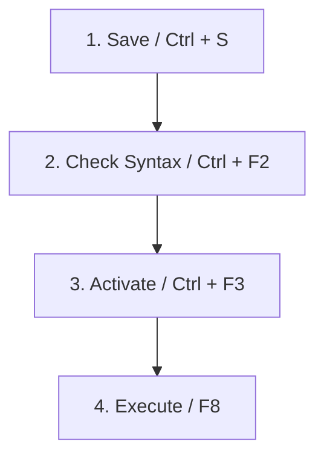

# First ABAP Program in SAP – Complete Beginner’s Guide

Writing your first ABAP program is an exciting milestone in your SAP development journey. Creating a simple "Hello World" report helps you understand the developer workflow, learn basic syntax rules, and build the confidence to tackle database tables and dictionary objects.

In this step-by-step tutorial, we will cover what ABAP programs are, why they are used, and how to create and execute one using transaction **SE38**.

---

## What is ABAP?

**ABAP** stands for **Advanced Business Application Programming**. It is a proprietary 4th-generation programming language created by SAP. It forms the technical backbone of the entire SAP ecosystem and is used to develop:

* **Reports**: Structured lists presenting database data.
* **Forms**: Invoices, purchase orders, and layouts.
* **Interfaces**: Connecting SAP with external systems.
* **Enhancements**: Customizing standard SAP behavior.
* **Applications**: Custom modules and transactional tools.

---

## What is an ABAP Program?

An ABAP program is a collection of logical statements stored inside the SAP database repository. Unlike standard desktop applications, ABAP programs run entirely on the SAP application server and interact directly with the central database layer.

### Common ABAP Use Cases:
* Displaying master customer or employee lists.
* Calculating payroll or inventory values.
* Triggering background batch updates.
* Interacting with transactional database tables.

---

## Core Tooling: SE38 vs. SE80

To write ABAP programs, developers use two primary transaction codes:

| Transaction Code | Tool Name | Best Used For | Complexity |
| :--- | :--- | :--- | :--- |
| **SE38** | ABAP Editor | Simple report programs, quick scripts, code edits. | **Low (Recommended for Beginners)** |
| **SE80** | Object Navigator | Complex applications, classes, web dynpro, full packages. | **Medium to High** |

> 💡 **Tip:** For beginners, starting with **SE38** is recommended. It provides a focused environment for writing standalone reports without package navigation overhead.

---

## Prerequisites (Before You Start)

Before diving into the code, ensure you have:
1. **SAP GUI Installed**: The desktop application to connect to the SAP server.
2. **Login Credentials**: A valid SAP username and password.
3. **Developer Key**: If you are working on a shared sandbox/client, you might need a developer registration key to create custom objects (pre-assigned by your SAP administrator).
4. **System Access**: Connection details to a Development (DEV) or Sandbox system.

---

## Step-by-Step Guide to Creating Your First Program

### Step 1: Open SAP GUI & Log In
Launch your SAP GUI, select your connection system from the list, and log in with your credentials. You will land on the standard **SAP Easy Access** dashboard screen.

---

### Step 2: Open Transaction SE38
In the transaction input field (command bar) in the upper left corner, type **`SE38`** and press **Enter**.


_The initial screen of the ABAP Editor (SE38) before entering a program name._

---

### Step 3: Name Your Custom Program
In the **Program** field, enter your program name.

> ⚠️ **Important Naming Rule:** Every custom program, table, or domain in SAP must start with the letter **`Z`** or **`Y`**. Standard names are reserved for SAP's built-in applications.
>
> **Example Name:** `Z_FIRST_ABAP_PROGRAM`


_Entering our custom program name starting with 'Z' in the Program input field._

---

### Step 4: Click the "Create" Button
Type the name and click **Create** (or press the F5 key). A popup dialog window will appear asking for the program's attributes.

---

### Step 5: Define Program Attributes
Enter the details as shown below:
* **Title**: `My First Hello World Program`
* **Type**: Select **Executable program** from the dropdown menu.
* Click **Save**.


_Defining the program title and setting the type as Executable program in the Attributes popup window._

---

### Step 6: Save to Local Objects
SAP will ask you to assign a development package. 
* For practicing and learning, click **Local Object** (or assign it to the **`$TMP`** package).
* This ensures your program is stored locally without generating a Transport Request (TR), meaning you don't need to migrate it to production.

---

## Writing the Code

Once the ABAP Editor screen opens, delete any default comments if you wish, and type the following statements:

```abap
REPORT z_first_abap_program.

* Write Statement to display output
WRITE 'Hello World! Welcome to SAP ABAP Daily.'.
```

### Line-by-Line Code Explanation:

1. **`REPORT z_first_abap_program.`**
 * Every executable program in ABAP must start with the `REPORT` keyword, followed by the program name and a period (`.`).
2. **`* Write Statement...`**
 * Any line starting with an asterisk (`*` in column 1) or characters after a double quote (`"`) is treated as a comment and ignored by the compiler.
3. **`WRITE 'Hello World!...'.`**
 * The `WRITE` statement outputs characters or variable values to the user screen. Texts must be enclosed in single quotes.

---

## Understanding Your ABAP Code Structure

Before checking and running the code, let's look at it visually inside the ABAP code editor. 

💡 **Interactive Code Assistant:** Hover over or tap the blue pulse indicator dots on the screenshot below to learn what each section of your code does!

<div class="relative w-full border border-hairline rounded-lg overflow-hidden my-6 bg-canvas-parchment shadow-product">
 
 
 <!-- Marker 1: REPORT Statement -->
 <div class="absolute left-[9.7%] top-[33.8%] group cursor-pointer">
 <div class="w-4 h-4 bg-primary rounded-full border-2 border-white shadow-md animate-pulse"></div>
 <div class="absolute left-6 top-1/2 -translate-y-1/2 ml-2 w-[280px] hidden group-hover:block bg-surface-black text-body-on-dark text-[12px] p-3 rounded-md shadow-xl border border-white/10 z-30 font-caption leading-relaxed">
  <strong class="text-primary-on-dark block mb-1">REPORT Statement (Line 6)</strong>
  Defines the executable program name. Every standard standalone report program starts with this keyword.
 </div>
 </div>

 <!-- Marker 2: DATA Declaration -->
 <div class="absolute left-[9.7%] top-[42.7%] group cursor-pointer">
 <div class="w-4 h-4 bg-primary rounded-full border-2 border-white shadow-md animate-pulse"></div>
 <div class="absolute left-6 top-1/2 -translate-y-1/2 ml-2 w-[280px] hidden group-hover:block bg-surface-black text-body-on-dark text-[12px] p-3 rounded-md shadow-xl border border-white/10 z-30 font-caption leading-relaxed">
  <strong class="text-primary-on-dark block mb-1">DATA Statement (Line 8)</strong>
  Declares a variable named <code>LV_NAME</code> of type <code>STRING</code> to store values in application memory.
 </div>
 </div>

 <!-- Marker 3: Variable Assignment -->
 <div class="absolute left-[9.7%] top-[52.5%] group cursor-pointer">
 <div class="w-4 h-4 bg-primary rounded-full border-2 border-white shadow-md animate-pulse"></div>
 <div class="absolute left-6 top-1/2 -translate-y-1/2 ml-2 w-[280px] hidden group-hover:block bg-surface-black text-body-on-dark text-[12px] p-3 rounded-md shadow-xl border border-white/10 z-30 font-caption leading-relaxed">
  <strong class="text-primary-on-dark block mb-1">Variable Assignment (Line 10)</strong>
  Assigns the literal string value <code>'Daksh'</code> to the newly created variable <code>LV_NAME</code>.
 </div>
 </div>

 <!-- Marker 4: WRITE Statement -->
 <div class="absolute left-[9.7%] top-[60.7%] group cursor-pointer">
 <div class="w-4 h-4 bg-primary rounded-full border-2 border-white shadow-md animate-pulse"></div>
 <div class="absolute left-6 top-1/2 -translate-y-1/2 ml-2 w-[280px] hidden group-hover:block bg-surface-black text-body-on-dark text-[12px] p-3 rounded-md shadow-xl border border-white/10 z-30 font-caption leading-relaxed">
  <strong class="text-primary-on-dark block mb-1">WRITE Statement (Line 12)</strong>
  Outputs the hardcoded text <code>'Welcome'</code> followed by the value of the variable <code>LV_NAME</code> to the report screen.
 </div>
 </div>
</div>

<div class="grid grid-cols-1 sm:grid-cols-2 gap-4 my-6 text-[14px] leading-relaxed">
 <div class="p-3 bg-canvas-parchment rounded border border-hairline">
 <strong class="text-primary">① REPORT Statement (Line 6)</strong>: Defines the executable program name. Every report must begin with this.
 </div>
 <div class="p-3 bg-canvas-parchment rounded border border-hairline">
 <strong class="text-primary">② DATA Declaration (Line 8)</strong>: Declares the variable <code>LV_NAME</code> of type <code>STRING</code>.
 </div>
 <div class="p-3 bg-canvas-parchment rounded border border-hairline">
 <strong class="text-primary">③ Assignment (Line 10)</strong>: Stores the value <code>'Daksh'</code> into the variable.
 </div>
 <div class="p-3 bg-canvas-parchment rounded border border-hairline">
 <strong class="text-primary">④ WRITE Statement (Line 12)</strong>: Prints the welcome text and the variable's value on the screen.
 </div>
</div>

---

## Saving, Syntax Checking, Activating, and Running

To execute your program, you must follow the standard **SAP Developer lifecycle** in this exact order:



### 1. Save (`Ctrl + S`)
Click the disk icon or press `Ctrl + S` to save your latest changes to the database.

### 2. Check Syntax (`Ctrl + F2`)
Click the Check button or press `Ctrl + F2`. If you made a mistake (like forgetting a period), SAP will show a syntax error at the bottom of the screen.

### 3. Activate (`Ctrl + F3`)
Click the matchbox/wand icon or press `Ctrl + F3`. Select your program name and click confirm. 

> 🚫 **Common Trap:** Many beginners save and check their code, but forget to **Activate** it. An inactive program will run its old saved version, or fail to run at all!

### 4. Execute (`F8`)
Click the clock icon with a checkmark or press **`F8`** to run your program. A new screen will open showing your output:
```text
Hello World! Welcome to SAP ABAP Daily.
```

---

## Expanding the Program: Variables and Multiple Lines

Let us look at two slightly more advanced examples to illustrate how to write multiline reports and manipulate variables.

### Example 1: Multiline Outputs using `/`
By default, consecutive `WRITE` statements print text side-by-side. To move to a new line, use the forward slash (`/`) symbol.

```abap
REPORT z_first_abap_program.

WRITE 'Welcome to SAP ABAP Training.'.
WRITE / 'Line 2: This is output on a new line.'.
WRITE / 'Line 3: Learning ABAP step-by-step.'.
```

### Example 2: Declaring Variables with `DATA`
Variables store data temporarily in the application memory. Here is how we declare, assign, and output a string variable:

```abap
REPORT z_first_program.

DATA: lv_name TYPE string.

lv_name = 'Daksh'.

WRITE: 'Welcome', lv_name.
```

When you execute this code, the output screen displays the concatenated variable results:


_The execution output showing 'Welcome Daksh' on the report screen._

> 💡 **Best Practice:** Notice the prefix `lv_` in the variable name. In ABAP development, `lv_` stands for **Local Variable**, `lt_` stands for **Local Table**, and `ls_` stands for **Local Structure**. Adhering to these conventions keeps your programs clean and readable!

---

## Practice Checkpoints (Test Your Knowledge)

Use these interactive cards to review what you have learned:

<details>
<summary>🙋‍♂️ <strong>Checkpoint 1:</strong> Why must custom program names start with Z or Y?</summary>
<div class="details-content">
Custom objects start with Z or Y to prevent them from being overwritten during SAP system upgrades. SAP reserving all other letters for standard programs ensures your custom code remains safe.
</div>
</details>

<details>
<summary>🙋‍♂️ <strong>Checkpoint 2:</strong> What happens if you run a program without activating it first?</summary>
<div class="details-content">
If the program was never activated, it cannot be run. If you modified an existing active program and saved it without activating, running it will execute the previous active version, ignoring your new changes.
</div>
</details>

<details>
<summary>🙋‍♂️ <strong>Checkpoint 3:</strong> What is the meaning of the colon (:) after the WRITE keyword?</summary>
<div class="details-content">
The colon is a chain operator in ABAP. It allows you to group multiple outputs together without repeating the `WRITE` keyword on every line (e.g., `WRITE: 'Hello', 'World'.` instead of `WRITE 'Hello'. WRITE 'World'.`).
</div>
</details>

---

## Common Mistakes Beginners Make

1. **Forgetting the Period (`.`):** Every statement in ABAP must end with a period. Leaving it out leads to immediate syntax errors.
2. **Missing Activation:** If your program runs but doesn't show your latest edits, verify if you activated it (`Ctrl + F3`).
3. **Invalid Namespaces:** Creating programs named `FIRST_PROG` (without Z or Y prefix) will fail as SAP will display a permission error.

---

## Conclusion & Next Steps

Congratulations! You have successfully written, compiled, activated, and run your first **SAP ABAP** program. 

Now that you have mastered the basics of transaction **SE38** and screen outputs using `WRITE`, you are ready to study:
* Conditional statements (`IF...ELSE`)
* Data looping (`LOOP AT...ENDLOOP`)
* Querying databases (`SELECT` statements)
* Creating custom tables using **SE11**

Happy Coding!
