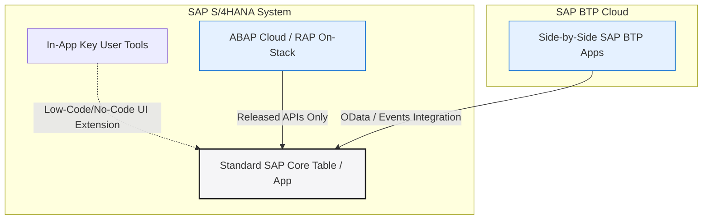

*Figure 1: In the Clean Core approach, the central ERP engine is kept pristine and isolated, with extensions connecting exclusively through official, released APIs.*

A few months ago, when I first heard the term "Clean Core" during my SAP learning, I honestly thought it was just another marketing buzzword. But as I started reading standard documentation, following developer blogs, and preparing for job interviews, I realized this concept is at the center of almost every technical discussion happening in the SAP world today. 

From keynote announcements at Sapphire to real-world technical rounds, Clean Core is the number one strategy organizations are aligning around. 

So, I decided to research it thoroughly and write a complete guide in plain, everyday language. This is a junior developer's guide to understanding the Clean Core strategy—written for people like me who want to grasp the practical logic, not just memorize textbook definitions.

---

## What is Clean Core, in Simple Terms?

In the simplest words, Clean Core means keeping your SAP S/4HANA application core untouched. This means you do not alter standard database tables directly, you do not modify standard SAP code lines, and you do not call internal, unreleased SAP objects directly in your custom code. 

If a business needs a custom feature, you build it outside the core system using officially approved, upgrade-safe extension methods.

Think of it like this: imagine your SAP core system as a brand new smartphone. The Clean Core approach says you shouldn't open the phone casing and solder custom circuits onto the motherboard to add a new function. Instead, you download an application from the app store that talks to the hardware through official, secure software channels. The app can do amazing things, but it never compromises the phone's internal electronics.

This is critical because SAP is shifting toward cloud Software as a Service (SaaS) models. In a shared cloud environment, SAP cannot push automatic, smooth updates to customers if every client has physically rewired the inner workings of their core system. It would be impossible to maintain at scale.

---

## Why Has This Become Such a Big Deal Now?

For decades, the standard practice in ABAP development was to modify SAP standard code directly. If the business wanted a new validation rule on sales order screens, the developer would find a user exit or directly modify the standard core code. While this worked in the short term, it created a massive technical debt that only surfaced when it came time to upgrade the system.

Imagine an organization running S/4HANA with hundreds of small custom modifications scattered across standard modules, written by different developers over 10 or 15 years. When SAP releases a system update, the upgrade process becomes a massive project. Every single custom modification must be manually reviewed, re-tested, and rewritten because standard SAP updates might change the underlying objects.

By keeping the core clean, you decouple the custom logic from the standard system, ensuring that upgrades run smoothly without breaking custom operations.

```mermaid
graph TD
    subgraph The Legacy Way (High Upgrade Friction)
        A[Standard SAP Core Object] -.->|Directly Modified/Modified Code| B[Custom Logic]
        Update[SAP Cloud Update] -->|Overwrites/Breaks| A
    end
    subgraph The Clean Core Way (Zero Upgrade Friction)
        C[Standard SAP Core Object] -->|Released Public API| D[API Interface Layer]
        D --> E[Custom ABAP Cloud / BTP App]
        Update2[SAP Cloud Update] -->|Updates Safely| C
    end
    style A fill:#ffeaea,stroke:#cc0000,stroke-width:1px
    style C fill:#e5f1ff,stroke:#0066cc,stroke-width:1px
    style D fill:#f5f5f7,stroke:#1d1d1f,stroke-width:1px
```

---

## The Five Pillars of Clean Core

A common misunderstanding is that Clean Core is just about coding. It is actually a complete strategy based on five distinct pillars:

1. **Fit-to-Standard Processes**: use standard SAP business processes out of the box instead of immediately writing custom code.
2. **Modern Extensibility**: Build all mandatory customizations using official tools like RAP, ABAP Cloud, or side-by-side BTP apps.
3. **Data Governance**: Maintain strict data quality, compliance, and consistency rules across the board.
4. **API-Based Integrations**: Connect systems to external partners using published, stable interfaces (like OData V4) instead of old-school, direct database connections.
5. **Operational Model**: Implement automated checks (like Clean Core transport gates) and continuous testing over time.

---

## Understanding the Extensibility Models

Where does your custom code actually live if you cannot modify the core? SAP provides three official models for developers:



### 1. In-App Extensibility (Key User Extensibility)
Designed for business analysts and key users. This uses low-code/no-code tools inside the S/4HANA UI to add custom fields or adapt simple forms without writing actual code.

### 2. On-Stack Developer Extensibility (ABAP Cloud)
This is our domain. We write ABAP Cloud code inside the S/4HANA system using RAP, but we are restricted to calling only released APIs and objects. It stays close to the database for high performance, but is fully isolated from the standard core.

### 3. Side-by-Side Extensibility (SAP BTP)
Custom applications are built completely outside S/4HANA on the SAP Business Technology Platform (BTP). They communicate with the ERP core using APIs and events.

### Extensibility Model Selection Guide

| Metric | On-Stack Developer Extensibility | Side-by-Side (SAP BTP) |
| :--- | :--- | :--- |
| **Development Language** | ABAP Cloud / RAP | ABAP, Java, JavaScript, Python, etc. |
| **Data Access** | Fast, direct access (no network overhead) | Remote access via HTTP OData / REST APIs |
| **S/4HANA Coupling** | Tightly coupled (runs on the same stack) | Fully decoupled (independent scaling) |
| **Best Use Case** | Modifying standard UI behavior, deep data processing | Portals, customer-facing apps, third-party syncs |

---

## The Four-Level Maturity Model

Rather than categorizing customizations as simply "clean" or "unclean", SAP uses a structured four-level maturity scale to evaluate existing codebases:

- **Level A (Extend with SAP Build)**: Zero core impact. Highly compliant extensions built with SAP Build or BTP using only stable, released public interfaces.
- **Level B (use Classic APIs)**: Fully compliant, but utilizes classic SAP APIs and older standard development frameworks. These are upgrade-safe but use previous-generation structures.
- **Level C (Accesses Internal Objects)**: Partially compliant. Customizations that still call internal, unreleased SAP elements, carrying moderate upgrade risks.
- **Level D (Non-Compliant)**: Legacy setups with direct modifications to standard SAP code or database tables, which block upgrade paths and increase maintenance costs.

---

## Clean Core Certification & AI

At Sapphire 2026, SAP introduced the **Clean Core Certification Programme**. This certifies that partner-built extensions are compatible with S/4HANA updates across at least three consecutive release cycles.

This is highly relevant for AI integrations. To smoothly run the 50+ Joule AI agents that SAP is deploying, your core system must receive smooth, automated cloud updates. Non-compliant configurations block these upgrades, locking the business out of modern AI capabilities.

---

## What This Means for Your Career and Interview Prep

If you are a fresher preparing for an ABAP developer role like me, here is how you should use this knowledge:

- **Shift in expectations**: Interviewers no longer just look for raw syntax knowledge (like `SELECT` loops). They expect you to understand *why* Clean Core matters.
- **Understand the business value**: Explain Clean Core for upgrade cost savings, system stability, and modern cloud deployment speed.
- **Connect your projects**: When showcasing your practice projects (like a leave tracker built with RAP), emphasize how you used only released APIs to keep the core clean.

---

## Gotchas You Should Know About
Many students think Clean Core simply means "don't customize anything at all," which is incorrect. Clean Core doesn't mean zero customization; it means customizing correctly, using approved methods, keeping things decoupled, and documenting properly. 

Another common confusion is treating "Clean Core" and "Side-by-side extensions" as the exact same thing. Side-by-side on BTP is just one method of achieving a clean core. On-stack developer extensibility using RAP, if done correctly following released APIs, is an equally valid Clean Core compliant approach.

---

## Summary Reference Table

| Term | Simple Meaning |
| :--- | :--- |
| **Clean Core** | Keeping SAP core system unmodified, extending functionality outside. |
| **In-App Extensibility** | Simple no-code changes done by business key users. |
| **On-Stack Extensibility** | Custom logic built inside S/4HANA using ABAP Cloud and RAP. |
| **Side-by-Side Extensibility** | Independent apps built on BTP, connected via APIs. |
| **Maturity Scale** | Level A (fully compliant) to Level D (non-compliant) upgrade-safety score. |
| **Clean Core Certification** | Official badge confirming an extension stays compatible across updates. |

---

## My Honest Closing Thoughts

Writing this blog actually helped me understand Clean Core much deeper than before, because explaining something forces you to genuinely understand it first, not just memorize surface level definitions.

If you are a fresher like me, don't treat Clean Core as just another interview buzzword. Try connecting it with actual hands-on practice. Whenever you build a small practice project on a trial system, consciously check whether your approach stays Clean Core compliant. That habit alone will make you stand out during technical interviews.

*Written by Daksh – SAP ABAP Developer in training, sharing real learning journey through learnsapfree.com*
