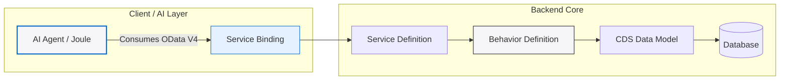
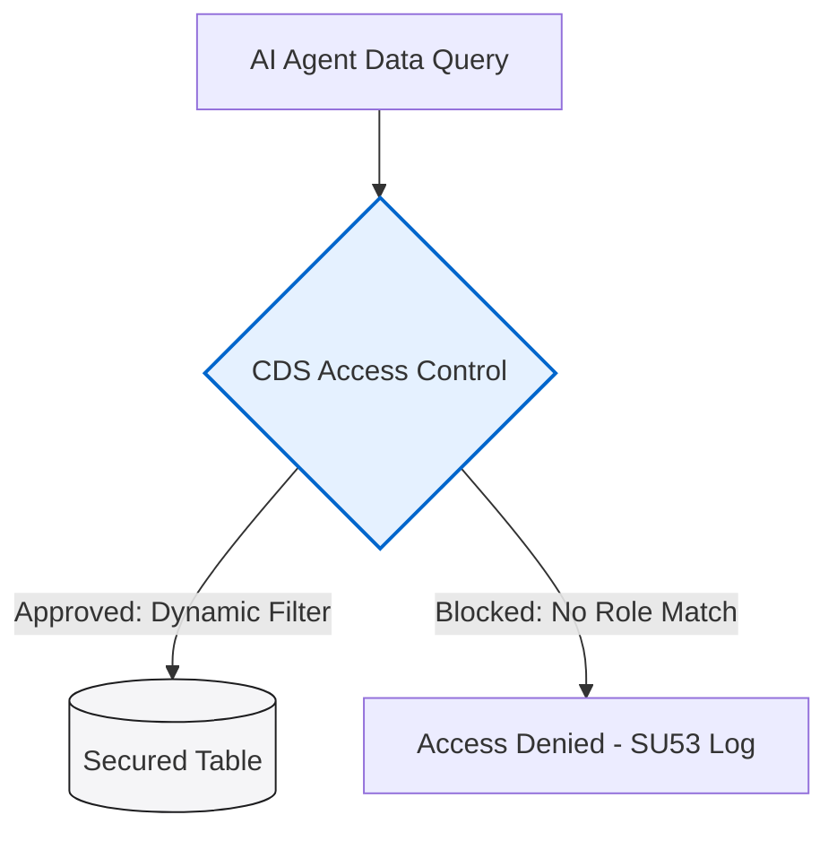

*Figure 1: Traditional ABAP development environments are directly merging with generative AI neural models to automate boilerplate tasks.*

If you are an ABAP developer—or a fresher preparing for a junior development role like me—you have probably noticed something massive shifting in our world lately. SAP is building generative AI directly into the ABAP development workflow. And it’s not just a minor autocomplete update; it’s a complete pivot in how we are going to write code, build models, and configure integrations.

To be completely honest, when I first started reading about these developments, it was a little intimidating. I kept asking myself: *"If AI can write all the code, what is the value of a junior developer?"* 

But after doing a close look, talking to experienced consultants, and looking at the actual frameworks, I realized that the future is very different from the rumors. Let me break down exactly what’s happening in simple, realistic terms.

---

## What Exactly Is Happening in the ABAP World?

SAP has been building **Joule for Developers**, which is an AI assistant built directly inside ABAP Development Tools (ADT). Along with this, SAP released their own foundation model called **SAP-ABAP-1**, which is trained specifically on an immense dataset of about 250 million lines of ABAP code. 

This isn't a generic chatbot like ChatGPT. It knows the difference between legacy syntax and Clean Core ABAP. It understands the RESTful Application Programming Model (RAP), CDS annotations, BOPF, and BAdI implementations.

The bigger shift is toward what SAP calls **Agentic AI**. Instead of just completing your current line of code, the AI acts as an autonomous helper that understands requirements, scaffolds RAP objects, generates CDS views, creates unit tests, and explains complex legacy logic.

### Evolution of AI in Development

| Feature | The Old Way (Single-Line Suggestions) | The Modern Agentic Way (2026) |
| :--- | :--- | :--- |
| **Scope** | Autocompletes standard syntax strings | Generates multiple related files and test structures |
| **Logic** | Requires line-by-line developer inputs | Understands overall functional specifications |
| **Testing** | Manual generation of unit tests | Automatic generation and execution of test classes |
| **Auditing** | No built-in compliance checks | Scans for Clean Core and security compliance |

---

## Why This is Good News for Freshers

I know a lot of students get worried when they hear that AI is writing code. But the actual situation is quite encouraging.

SAP itself explicitly highlights that AI-generated ABAP code is not automatically enterprise-ready. All AI-generated outputs still require human governance, code quality reviews, and Clean Core compliance checks before they can ever go into production. 

This means the developer's role is shifting, not disappearing. Instead of spending hours memorizing exact syntax and typing out boilerplate lines, developers will spend more time analyzing business requirements, reviewing AI suggestions for logic flaws, and ensuring compliance. That is a much higher-value skill than just typing syntax.

If you are starting out, having a strong grasp of the fundamentals—like understanding how business objects work in RAP, how CDS view associations behave, and how data flows—is your real advantage. You’ll be the one directing and auditing the AI tool.

---

## What is Joule for Developers?

Joule for Developers (often referred to as J4D) is an AI assistant integrated directly inside Eclipse ADT. It helps developers with several key tasks:

- **Predictive Code Generation**: Scaffolding business objects and behavior definitions in RAP.
- **Code Explanation**: Explaining complex legacy code blocks in plain English.
- **Unit Test Generation**: Automatically writing test classes to check code coverage.
- **Compliance Audits**: Scanning custom code to ensure it conforms to Clean Core rules.

```abap
" Example of a structured unit test scaffolded automatically by Joule
CLASS lcl_unit_test DEFINITION FOR TESTING
  DURATION SHORT
  RISK LEVEL HARMLESS.
  PRIVATE SECTION.
    METHODS:
      setup,
      test_order_creation FOR TESTING,
      teardown.
ENDCLASS.
```
*Note: SAP has made Joule for Developers accessible for testing through developers' licenses until September 2026, so if you have access to a sandbox or trial system, it is highly recommended to try it hands-on.*

---

## SAP-ABAP-1: SAP's Proprietary AI Model

Unlike GitHub Copilot or generic coding assistants that learn from open-source repositories in a hundred different languages, SAP-ABAP-1 is a custom-trained model built specifically for SAP's language semantics. 

By training the model on millions of lines of proprietary and public SAP code, SAP has created an engine that understands CDS view syntax, authorization control definitions, and RAP behaviors far more accurately than generic LLMs. It is designed to think like an SAP developer rather than a general-purpose programmer.

---

## Why RAP Has Become Mandatory

This is a vital point for anyone learning ABAP today. All these new AI capabilities, modern extension patterns, and Fiori integrations are built on top of the RAP model. 

RAP produces structured, OData V4 services. AI agents need this structured, predictable framework to understand data properties and interact with business systems.



If you are still only practicing classic report writing or old-school dialog programs, you are learning tools that are already fading out. Make RAP your priority. Understanding behavior definitions, actions, determinations, and validations will set you up for success in this new AI-connected world.

---

## Clean Core & Security Concerns

You’ll hear the term **Clean Core** everywhere in modern SAP projects. It means keeping the standard SAP system unmodified and building all custom extensions separately (either on-stack using RAP or side-by-side using SAP BTP).

AI makes this structure even more critical. When AI agents start querying database entities automatically, data security becomes very important. For example, setting access control checks incorrectly in CDS views (`@AccessControl.authorizationCheck: #NOT_REQUIRED`) is no longer just a minor oversight—it’s a major security vulnerability. 



Setting up proper roles and authorizations is vital when code is queried by autonomous agents. Understanding how to restrict data exposure dynamically is a key skill for modern developers.

---

## What is an ABAP MCP Server?

Here is a new concept: Model Context Protocol (MCP). Think of it as a standard plug that lets AI coding agents (like Claude, GitHub Copilot, or Joule) communicate directly with your local ABAP system. 

An ABAP MCP Server gives the AI agent a deep, structured way to interact with ADT—allowing it to scaffold files, check dependencies, run Clean Core checks, and execute tests automatically. Learning the basics of MCP now will place you ahead of many experienced developers who haven't yet explored the AI-tool connectivity layer.

---

## My Personal Roadmap & Practical Advice

Based on my own study path, here is the checklist I am using to prepare for this transition:

1. **Master RAP and CDS Views**: This is the absolute baseline. If your fundamentals here are shaky, AI won't help you much because you won't spot its errors.
2. **Experiment with AI Coding Assistants**: If you have access to a trial system, use Joule for Developers hands-on. Get used to the feel of co-authoring code.
3. **Understand Security & Access Control**: Learn how `@AccessControl` annotations and DCL (Data Control Language) work.
4. **Learn Basic Python**: Many AI agent frameworks are Python-centric, so being able to read and understand basic scripts is a major asset.
5. **Stay Connected to the Community**: The pace of change is incredibly fast. Keep reading SAP Community blogs to stay ahead.

---

## Will AI Replace ABAP Developers?

The short answer is **no**, but the role is definitely changing. 

Earlier, an ABAP developer's main value was writing correct syntax and remembering commands. Now, AI can help with that part faster than any human. But the real value shifts toward understanding business requirements, designing clean architectures, reviewing AI output for correctness, ensuring Clean Core compliance, and handling complex edge cases that AI still struggles with.

Instead of becoming irrelevant, developers who combine strong ABAP fundamentals with AI tool fluency are becoming more valuable. That combination is rare right now, and the gap is wide open for people willing to learn both sides properly.

---

## Practical Next Steps
AI in the ABAP world is not a passing trend; it is a permanent direction. As junior developers, the best thing we can do is stay updated, keep our fundamentals strong (especially in RAP and CDS), and start experimenting with these tools whenever possible instead of waiting.

I will keep sharing more updates on this topic as I learn further, along with practical posts once I get proper access to test these tools myself. Keep following the blog for more real learning journey content!

*Written by Daksh – SAP ABAP Developer in training, sharing real learning journey through learnsapfree.com*
