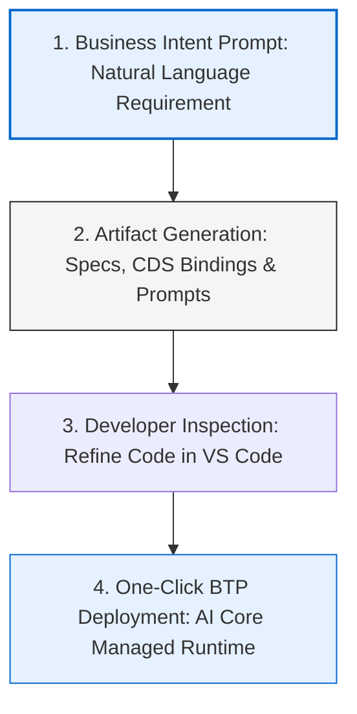

*Figure 1: Joule Studio 2.0 provides an interactive development environment to model, test, and orchestrate custom AI agents across the SAP ecosystem.*

When SAP Sapphire 2026 took place, one single announcement basically took over every SAP-related blog, LinkedIn post, and community discussion I came across: **Joule Studio 2.0**. 

At first, I thought it was just another generic AI chatbot update, similar to the hundreds of AI tools launching everywhere these days. But once I dug deeper into what it actually does under the hood, I realized this is a massive shift for the SAP ecosystem.

I'm writing this blog for fellow SAP learners and freshers like myself. This topic is coming up constantly in job discussions, and having a solid grasp of how it works will help you stand out during technical interviews. Let's break it down piece by piece, in plain English.

---

## What is Joule Studio, in Simple Terms?

Before we talk about version 2.0, let me explain the basic concept first. Joule Studio is SAP's AI-first development environment built for creating custom AI agents, applications, and workflows. 

Powered by the SAP Business AI Platform, its main purpose is to help developers build AI agents that are natively grounded in their live business data, processes, and rules already sitting inside the SAP landscape.

Think of it this way: a generic AI chatbot knows general facts about the world, but it doesn't automatically understand your company's custom purchase order processes, pricing rules, or approval hierarchies. Joule Studio connects directly to your live SAP environment, so the agents you build are smart and context-aware from day one.

```
+-------------------------------------------------------------+
|                     Joule Studio 2.0                        |
|                                                             |
|   +-------------------+  +-------------------------------+  |
|   | Intent Engine     |  | Generative AI Hub             |  |
|   | (Natural Language)|  | (Claude, GPT-4o, Llama 3)     |  |
|   +---------+---------+  +---------------+---------------+  |
|             |                            |                  |
|             +--------------+-------------+                  |
|                            |                                |
|                            v                                |
|   +-----------------------------------------------------+   |
|   | SAP AI Core / BTP Managed Agent Runtime             |   |
|   +------------------------+----------------------------+   |
+----------------------------|--------------------------------+
                             | OData v4 / Event Mesh / MCP
                             v
+-------------------------------------------------------------+
|            S/4HANA Cloud / SAP Business Suite               |
|            - Master Data, Orders, Workflows                 |
+-------------------------------------------------------------+
```

---

## Generic AI vs. Grounded Business AI

| Feature / Metric | Generic Public AI Chatbots | Grounded Business AI (Joule Studio 2.0) |
| :--- | :--- | :--- |
| **Data Context** | General public web knowledge | Live SAP transaction data & business context |
| **System Security** | Minimal enterprise controls | Enforces standard SAP user authorizations (`S_TABU_DIS`, `S_DEVELOP`) |
| **Integration** | Manual custom API connectors needed | Built-in native connections to BTP, S/4HANA, and CAP/RAP services |
| **Process Action** | Text recommendations only | Autonomous process execution (e.g. posting journal entries, releasing POs) |
| **Data Privacy** | Customer prompts may train models | Strict SAP Zero Data Retention & isolated BTP tenant boundaries |

---

## Technical Architecture: SAP AI Core & Generative AI Hub Integration

Behind the user-friendly interface of Joule Studio 2.0 lies a complex cloud infrastructure hosted on **SAP Business Technology Platform (SAP BTP)**:

### 1. Generative AI Hub
Joule Studio 2.0 connects developers to leading commercial Foundation Models (including Anthropic Claude 3.5 Sonnet, OpenAI GPT-4o, and Meta Llama 3) hosted securely within SAP AI Core. Rather than managing separate API keys and credentials for each provider, Generative AI Hub acts as a unified proxy layer.

### 2. SAP Event Mesh Integration
Custom agents built in Joule Studio 2.0 can listen to enterprise events emitted by S/4HANA (e.g., `SalesOrder.Created` or `PurchaseOrder.Blocked`). When an event fires, the agent executes pre-configured inspection routines automatically.

### 3. Model Context Protocol (MCP) Support
Agents consume SAP OData v4 and CDS View services via MCP endpoints. When an agent requires context about a material or customer record, it queries the backend service safely over standard OData protocols.

---

## Intent-Based Development: How It Works

In traditional development environments, building an AI pipeline required manual prompt engineering, setting up vector databases, configuring RAG (Retrieval-Augmented Generation) pipelines, and writing custom Python orchestration scripts.

Joule Studio 2.0 changes this completely using **Intent-Based Development**. You describe the desired business outcome in plain natural language, and the platform scaffolds the technical artifacts automatically.



### The 4 Stages of Intent-Based Development:

1. **Business Intent Entry:** The developer or functional consultant types a natural language prompt describing the business problem (e.g., *"Build an agent that identifies high-risk credit customers and blocks unreleased sales orders exceeding $50,000"*).
2. **Artifact Generation:** The platform generates technical documentation, CDS view bindings, system prompt definitions, and an n8n visual flow graph.
3. **Developer Review & Handoff:** Pro-code developers export the generated code to Visual Studio Code or SAP Business Application Studio (BAS) to inspect, add custom ABAP/CAP logic, and tune performance.
4. **Managed BTP Deployment:** One-click deployment pushes the agent to the SAP AI Core managed runtime.

---

## Practical Walkthrough: Building a Custom Credit Risk Agent

Here is a step-by-step example showing how a developer builds a custom agent in Joule Studio 2.0:

### Step 1: Define Agent Intent
In Joule Studio, click **New Agent** and type:
> *"Monitor new sales orders for high-risk accounts. If customer credit score is below 600 and order value exceeds $25,000, trigger approval request to Credit Manager."*

### Step 2: System Tool Binding
Joule Studio automatically identifies required system services and prompts you to confirm tool bindings:
- **Primary Service:** `API_SALES_ORDER_SRV` (S/4HANA OData v4)
- **Credit Check Service:** `API_CREDIT_MANAGEMENT`
- **Notification Tool:** SAP Build Process Automation (Approval Form)

### Step 3: Configure Guardrails & Permissions
Specify safety controls in the Guardrails panel:
- **Read Restrictions:** Customer master data accessible only for authorized Sales Orgs.
- **Action Threshold:** Orders under $25,000 auto-approved; orders over $25,000 require human approval.

### Step 4: Test & Deploy
Run the agent in the interactive Joule Studio test sandbox. Simulate a test payload with `Customer 100029` and `Order Value 30,000`. Verify that the agent halts order processing and dispatches an approval task to SAP Build Work Zone.

---

## Enterprise Security, Data Privacy & GDPR Compliance

Enterprise customers cannot afford to expose proprietary financial or customer data to external AI models. SAP enforces strict security controls throughout Joule Studio 2.0:

1. **Zero Data Retention Policy:** Prompts and context payloads passed through Generative AI Hub are never retained by third-party LLM vendors or used to train public foundation models.
2. **Tenant Isolation:** Data processed by custom agents remains strictly contained within the customer's SAP BTP subaccount boundary.
3. **Role-Based Authorization Enforcement:** Agents inherit the active user's SAP credentials. If a user running an agent query lacks authorization for payroll table `PA0008`, the agent cannot read payroll fields.

---

## Key Technical Acronyms Explained (Interview Preparation)

- **MCP (Model Context Protocol):** Open standard protocol for connecting AI models to local databases, APIs, and developer tools over structured JSON-RPC.
- **A2A (Agent-to-Agent Protocol):** Open protocol standard (developed in alignment with Google) enabling SAP Joule agents to coordinate tasks with third-party agents (e.g. Salesforce or Microsoft Copilot agents).
- **RAG (Retrieval-Augmented Generation):** Architectural technique that fetches live database records to enrich LLM prompts with real-time enterprise facts.

---

## Frequently Asked Questions

### 1. What is the difference between the Joule Chatbot and Joule Studio 2.0?
The **Joule Chatbot** is the ready-to-use conversational assistant embedded across standard SAP Fiori screens for end users. **Joule Studio 2.0** is the developer workbench on SAP BTP used to build, customize, and deploy brand new AI agents and multi-agent workflows across your company's systems.

### 2. Can I build Joule Studio agents for custom Z-tables and custom ABAP logic?
Yes! Joule Studio agents can consume any custom OData service, RAP business object, or REST API endpoint exposed by your custom `Z` development packages.

### 3. Do custom AI agents require separate licensing on SAP BTP?
Custom agent execution runs on SAP BTP AI Core infrastructure and consumes BTP capacity units (SAP CPEA / Pay-As-You-Go agreements) based on foundation model token usage and processing runtime.

---

## Summary for SAP Developers

Joule Studio 2.0 represents a major step forward for enterprise AI development in the SAP ecosystem. By combining intent-based generation, native SAP data grounding, Generative AI Hub model access, and strict BTP security controls, SAP is enabling developers to build intelligent, autonomous business workflows.

Keeping your core ABAP, CDS, and RAP skills strong while learning how AI agents consume OData services is the best way to future-proof your SAP development career in 2026.
