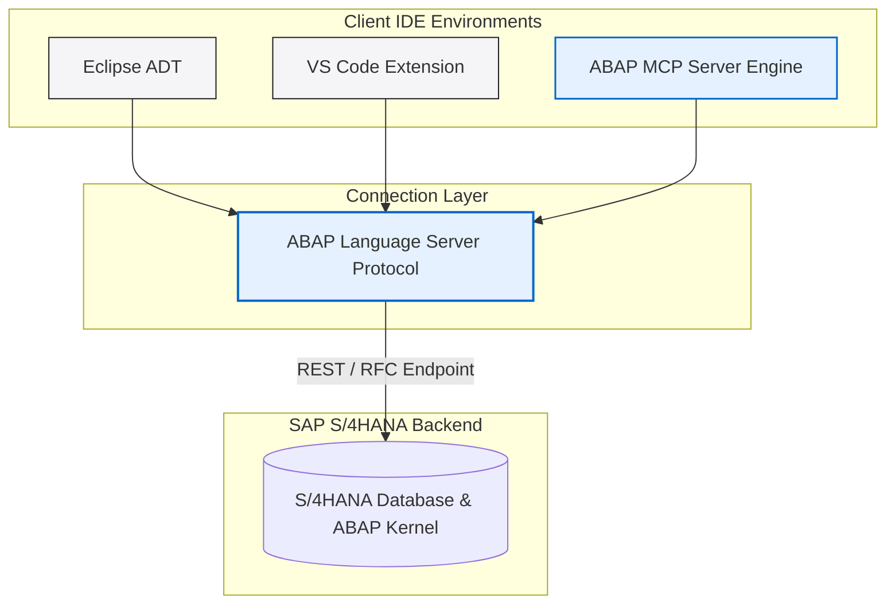
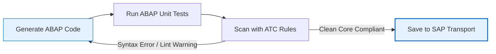

*Figure 1: Visual Studio Code connected directly to S/4HANA via the new ABAP Language Server and MCP protocol.*

A few weeks back, I was setting up SAP Fiori Tools inside VS Code for my own project, connecting to a local SAP instance. It was the same routine I always follow for building Fiori apps. While going through some SAP Community blogs during that setup, I stumbled onto something that genuinely stopped my scrolling: **SAP had officially released ABAP Development Tools for VS Code, along with built-in ABAP MCP Server capabilities.**

I didn't believe it at first. For as long as I’ve been learning ABAP, Eclipse was always the default recommendation—no alternative, no discussion. So seeing SAP bring ABAP code editing into VS Code, and pairing it with AI agent access, felt like a massive architectural shift.

Whether you are an ABAP developer, a fresher preparing for technical interviews, or just someone tracking where enterprise tooling is heading in 2026, this is something you should definitely try out. Let me break down exactly what’s happening in plain English.

---

## Why Eclipse Has Always Been "The" IDE

If you are newer to the SAP world, here is some quick context. Ever since the ABAP Development Tools (ADT) replaced the classic SE80 workbench years ago, Eclipse has been the official, recommended IDE for writing modern ABAP code—CDS views, RAP objects, classes, and behavior definitions.

The challenge is that Eclipse can feel quite heavy and resource-intensive compared to the lightweight, lightning-fast editors developers use today. Most modern developers spend their days in VS Code for web, cloud, and UI5 tasks. Forcing developers to switch back and forth between a heavy Eclipse instance and VS Code creates a lot of workflow friction.

### Feature Comparison: VS Code vs. Eclipse ADT vs. SE80 Workbench

| Capability / Metric | Visual Studio Code Extension | Eclipse ADT (ABAP Development Tools) | Classic SE80 ABAP Workbench |
| :--- | :--- | :--- | :--- |
| **Primary Architecture** | Modern Language Server Protocol (LSP) + MCP | Eclipse ADT Backend Plugins | Native SAP GUI Dynpro Workbench |
| **System Footprint** | Ultra-lightweight, instant boot | Moderate to Heavy RAM usage | Hosted on SAP GUI Client |
| **RAP / CDS Support** | Native support for RAP & CDS objects | Full support for all CDS/RAP tools | Basic or un-supported for modern RAP |
| **AI Agent Integration** | Native MCP Protocol Server | Community plugins / basic autocomplete | None |
| **Dynpro Screen Painter** | Unsupported | Supported via embedded SAP GUI | Native built-in Screen Painter |
| **ABAP Cloud / Steampunk** | Fully optimized | Fully optimized | Not supported for ABAP Cloud |

---

## Understanding the Architecture: The ABAP Language Server

This isn't just a simple copy-paste or a basic theme wrapper. It's a completely redesigned architecture. Under the hood, SAP built the **ABAP Language Server**, which acts as a common abstraction layer between the S/4HANA backend and your IDE.



Both Eclipse ADT and the new VS Code extension connect to this same shared language server. This is a key architectural decision because it guarantees feature parity: instead of VS Code getting a stripped-down "lite" version while Eclipse keeps the real features, both pull from the exact same backend engine.

---

## What is the ABAP MCP Server?

This is where things get really interesting. MCP stands for **Model Context Protocol**, which is an open-source standard originally designed by Anthropic and now adopted across the AI industry. MCP defines a standard protocol that lets AI coding agents discover and run tools or fetch external database context over JSON-RPC.

The built-in **ABAP MCP Server** exposes your local SAP system's resources directly to MCP-compatible AI agents (like Claude Code, Cursor, or GitHub Copilot).

This solves the classic problem with generic AI tools in the SAP space: *a lack of context*. Generic AI models can guess how to write standard ABAP syntax, but they cannot see your custom Z-tables, active global classes, or system dependencies. ABAP MCP Server provides that secure, local connection, allowing the AI agent to give highly customized, grounded recommendations.

---

## What Can AI Agents Actually Do Once Connected?

Once connected through the MCP server, the coding assistant's capabilities expand dramatically:

- **System Context Awareness**: The agent can inspect actual database schemas, tables, and definitions inside your development client using tools like `adt_get_object_structure`.
- **Autonomous Investigation**: You can ask, *"explain how the ZCL_CUSTOMER_MGMT class handles validation,"* and the agent will locate the class, read the behavior definition, and explain it step-by-step.
- **Agentic Refactoring Loops**: An AI agent can generate an ABAP class, trigger `adt_syntax_check`, run ABAP Unit tests, inspect ABAP Test Cockpit (ATC) findings, and fix errors autonomously until code compiles cleanly.



---

## Technical Security Architecture & Authorization

A common concern enterprise IT security teams raise when connecting AI models to SAP systems is data safety. How does SAP protect proprietary business data from leaking?

1. **Role-Based Access Control (RBAC):** The ABAP MCP Server does not bypass SAP authorizations. The AI agent operates strictly under the developer user account credentials (`S_DEVELOP` authorization object). If the developer lacks access to read payroll tables, the MCP server rejects the AI agent's request.
2. **Local Session Execution:** MCP server calls run locally over encrypted HTTPS endpoints directly between VS Code and your SAP Application Server. Code context is not uploaded to public training sets.
3. **Audit Trail Logging:** All transactions and code modifications executed through MCP tools log into standard SAP audit logs (`SM20`) with the developer's user ID.

---

## Setting Up VS Code ADT & ABAP MCP Server: Step-by-Step

Follow these exact steps to configure VS Code for ABAP development and enable MCP capabilities:

### Step 1: Install Required Extensions in VS Code
1. Launch Visual Studio Code.
2. Open the Extensions pane (`Ctrl+Shift+X` / `Cmd+Shift+X`).
3. Search for and install:
   - **ABAP Development Tools for Visual Studio Code** (Publisher: *SAP SE*)
   - **SAP Fiori Tools - Extension Pack**

### Step 2: Configure System Connection
1. Open the Command Palette (`Ctrl+Shift+P` / `Cmd+Shift+P`).
2. Search for **ABAP: New Destination**.
3. Fill in your target S/4HANA or ABAP Cloud system parameters:
   - **System Name:** `S4H_DEV`
   - **Server URL:** `https://vhcalabaps.dummy.sap.com:44300`
   - **Client:** `100`
   - **Language:** `EN`
4. Enter your SAP system username and password when prompted.

### Step 3: Configure MCP Server JSON Settings
Open your VS Code `settings.json` file and add the ABAP MCP configuration block:

```json
{
  "abap.ai.enableMcpServer": true,
  "abap.ai.mcpServerPort": 3010,
  "abap.connection.defaultDestination": "S4H_DEV",
  "mcpServers": {
    "abap-adt": {
      "command": "node",
      "args": [
        "${userHome}/.vscode/extensions/sap.abap-adt-vscode/out/mcp/server.js"
      ],
      "env": {
        "SAP_DESTINATION": "S4H_DEV"
      }
    }
  }
}
```

### Step 4: Verify Agent Connection
Open your MCP-compatible AI chat assistant (such as Claude Code or Cursor) and run a diagnostic prompt:

> *"List the fields and data elements of custom table ZEMPLOYEE from the connected SAP system."*

The AI agent executes `adt_get_table_metadata`, fetches the live table schema from `SE11` over MCP, and displays the exact column definitions.

---

## Real-World Refactoring Case Study: Migrating to Clean Core

Suppose you are tasked with refactoring a legacy ABAP report that uses deprecated `WRITE` statements, direct `SELECT *` from `BSEG`, and obsolete function modules into modern S/4HANA ABAP Cloud standards.

### Step 1: Prompt AI Agent via MCP
> *"Analyze program ZLEGACY_FINANCE_REPORT and refactor it into an ABAP Cloud compliant class using CDS views and Clean Core guidelines."*

### Step 2: Agent Execution Loop
1. Agent invokes `adt_get_source` tool -> Reads `ZLEGACY_FINANCE_REPORT`.
2. Agent detects `BSEG` direct access warning from ATC engine.
3. Agent generates a new CDS View `ZI_JournalEntryItem` for financial data.
4. Agent generates an ABAP Class `ZCL_FINANCE_REPORT_RUNNER` consuming the CDS View.
5. Agent triggers `adt_syntax_check` -> Verifies 0 syntax errors.
6. Agent saves objects to your active SAP transport request.

---

## Current Scope & Limitations

While this is a major leap forward for SAP development, developers should keep current scope limitations in mind:

- **Optimized for ABAP Cloud & RAP:** The VS Code extension focuses on modern RAP objects (CDS views, Behavior Definitions, Service Bindings, Classes).
- **No Classic Screen Painter:** If your maintenance requires legacy SAP GUI Dynpro screens (`SE51` Screen Painter), Eclipse ADT or classic SAP GUI remains necessary.
- **S/4HANA 2022+ Requirement:** Complete ABAP Language Server capabilities require modern SAP S/4HANA releases or SAP BTP ABAP Environment.

---

## Frequently Asked Questions

### 1. Does VS Code replace Eclipse ADT completely for ABAP developers?
Not completely. VS Code is ideal for RAP development, UI5 integration, and AI-assisted coding. Eclipse ADT remains necessary for legacy SAP GUI screen painter tasks and older NetWeaver releases.

### 2. Is the ABAP MCP Server secure for enterprise SAP environments?
Yes. The MCP server respects standard SAP authorizations (`S_DEVELOP`), runs locally over encrypted endpoints, and logs all actions to standard SAP audit logs (`SM20`).

### 3. Can I use GitHub Copilot or Claude Code with the ABAP MCP Server?
Yes. Any AI agent or assistant supporting the Model Context Protocol (MCP) standard can connect to the server and inspect SAP system context.

---

## Summary

The release of ABAP Development Tools for VS Code and the ABAP MCP Server represents a major step forward for SAP development. By combining lightweight VS Code editing with AI context protocol integration, SAP is giving developers modern, flexible tools to build S/4HANA applications.
